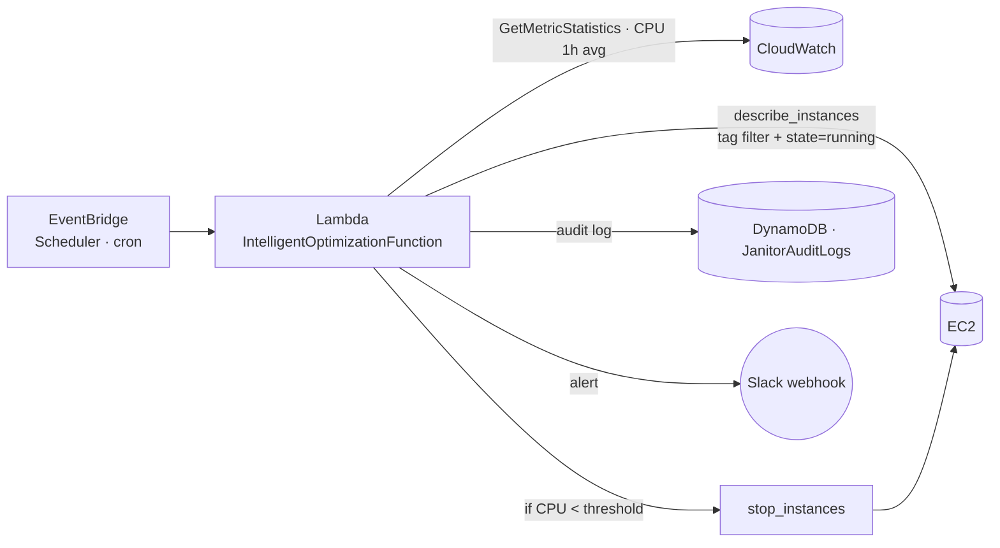

# CloudWarden

[](https://github.com/emredogan-cloud/CloudWarden/actions/workflows/main.yaml)

CPU-aware autonomous shutdown bot for EC2: scans tagged instances on a schedule, pulls the last-hour `CPUUtilization` average from CloudWatch, and decides — **stop the instance, alert the channel, or leave it alone** — based on configurable thresholds. Every action is recorded in DynamoDB for audit.

Deployed as a single AWS SAM stack: Lambda + EventBridge Scheduler + DynamoDB + Slack webhook.




---

## Decision logic

For each running, tag-matched instance:

| Last-hour CPU avg | Action |
|---|---|
| `< 10 %` | `StopInstances` · audit `AUTO_STOP` in DynamoDB · Slack notice |
| `> 80 %` | Slack overload alert · no instance change |
| otherwise | Log only — instance is healthy |

The thresholds live in `src/app.py`. The "low" branch performs the only mutating API call in the stack.

---

## Stack

| Component | Detail |
|---|---|
| Runtime | Python 3.12, 128 MB, 20 s timeout |
| Schedule | `cron(0 0 0 */2 * ? *)` — every two days (configurable) |
| Filter | `tag:Env=Dev` (parametrized via `TargetTagKey` / `TargetTagValue`) + `instance-state-name=running` |
| Audit | `JanitorAuditLogs` DynamoDB table (`InstanceId` PK · `ActionTime` SK, PAY_PER_REQUEST) |
| Notification | Slack webhook (`SlackWebhookUrl` parameter, `NoEcho: true`) |
| IaC | AWS SAM (`AWS::Serverless::Function`) |

---

## Repository Layout

```
CloudWarden/
├── template.yaml            # SAM stack: Lambda + DDB + Schedule
├── src/
│   └── app.py               # lambda_handler — CPU analysis + decisions
├── utils/
│   ├── session.py           # boto3 session singleton
│   └── logging.py
├── requirements.txt
└── LICENSE
```

---

## Deploy

Prerequisites: AWS CLI, [SAM CLI](https://docs.aws.amazon.com/serverless-application-model/latest/developerguide/install-sam-cli.html), Python 3.12.

```bash
sam build
sam deploy --guided
```

Parameters prompted:

- **TargetTagKey** — default `Env`
- **TargetTagValue** — default `Dev`
- **SlackWebhookUrl** — `https://hooks.slack.com/...` (stored encrypted via `NoEcho`)

### Update

```bash
sam build && sam deploy
```

### Tear down

```bash
sam delete --stack-name <stack-name>
```

---

## Required IAM

The function role (assembled by SAM) holds:

- `AWSLambdaBasicExecutionRole`
- `ec2:DescribeInstances`, `ec2:StopInstances`
- `cloudwatch:GetMetricStatistics`
- `dynamodb:PutItem`

All scoped to `Resource: '*'` in the template; a production hardening pass should constrain `StopInstances` to a `Condition` clause that enforces `aws:ResourceTag/Env=Dev`.

---

## Operational Notes

- **`Resource: '*'` on `StopInstances` is intentional in the demo.** In production, replace with a tag-condition policy.
- **CloudWatch needs detailed monitoring or a full hour of data.** Instances younger than the metric window get a `No Data Found` log line and are skipped — safe by default.
- **Slack rate limits.** Every alert is a single POST; no batching is needed at the scales this script targets.
- **DynamoDB is the audit trail.** The table is the system of record for "what did the bot do, and why" — preserved beyond Lambda log retention.

---

## License

[MIT](LICENSE)
