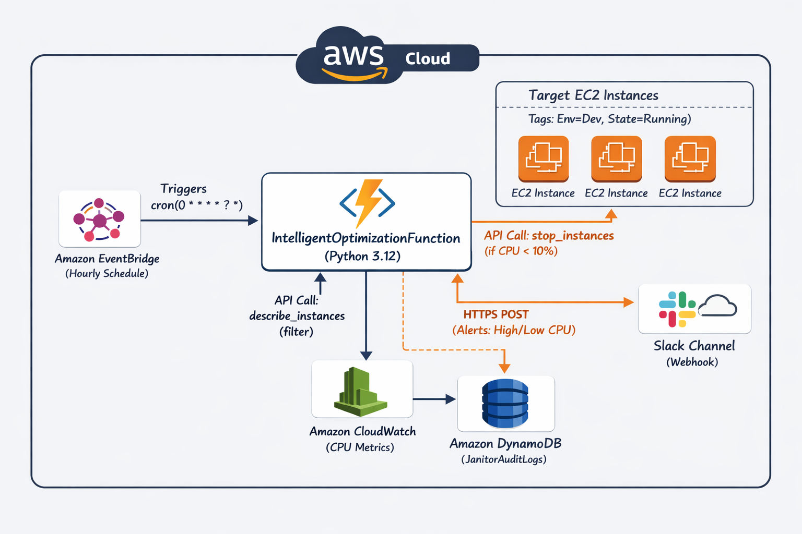

#  AWS CloudWarden(FinOps Automation)

## Architecture Diagram




  

*CloudWarden 🛡️

A lightweight, serverless automation tool designed to slash AWS costs and monitor performance. CloudWarden autonomously scans your EC2 instances, analyzes CPU utilization, and takes decisive action:

    💰 Cost Saver: Automatically stops instances with <10% CPU usage (with Slack notification).

    🚨 Performance Alert: Instantly pings developers via Slack if CPU spikes >80%.

    ⚙️ Zero Maintenance: Fully automated via EventBridge Scheduler (runs every 2 days).

Built with: Python/Boto3, AWS Lambda, EventBridge, Slack API.

##  Key Features

* ** Intelligent Analysis:** Checks CloudWatch metrics (CPU Utilization) before taking action.
* ** Cost Saving:** Automatically stops instances if CPU < 2.5% (Idle).
* ** Safety First:** Never interrupts active servers (> 2.5% CPU).
* ** Smart Alerts:** Sends Slack notifications if a server is overloaded (> 80% CPU).
* ** Audit Logging:** Records every action to **Amazon DynamoDB** for compliance.
* ** Tag-Based:** Only targets instances with specific tags (e.g., `Env:Dev`).

##  Architecture

1.  **Amazon EventBridge:** Triggers the Lambda function every hour.
2.  **AWS Lambda (Python):**
    * Scans EC2 instances using `boto3` paginators.
    * Fetches CPU metrics from **Amazon CloudWatch**.
3.  **Decision Engine:**
    * *Is CPU < 10%?* -> **STOP Instance** & Write to **DynamoDB**.
    * *Is CPU > 80%?* -> Send Alert to **Slack**.
4.  **Amazon DynamoDB:** Stores audit logs (Who, When, Why).

##  Installation & Deploy

This project is built using **AWS SAM (Serverless Application Model)**.

### Prerequisites
* AWS CLI & SAM CLI
* Python 3.12
* A Slack Webhook URL

### Deploy
```bash
# 1. Build the project
sam build

# 2. Deploy to AWS (Follow the prompts)
sam deploy --guided

During deployment, you will be asked for:

  -  TargetTagKey: (Default: Env)

  -  TargetTagValue: (Default: Dev)

  -  SlackWebhookUrl: Paste your Slack Webhook URL here.

Tech Stack

   -  Compute: AWS Lambda

   - Database: Amazon DynamoDB

   - Monitoring: Amazon CloudWatch

   - IaC: AWS SAM (CloudFormation)

   - Language: Python 3.12 (Boto3, Urllib3)

-LICENCE

MIT LICENSE
